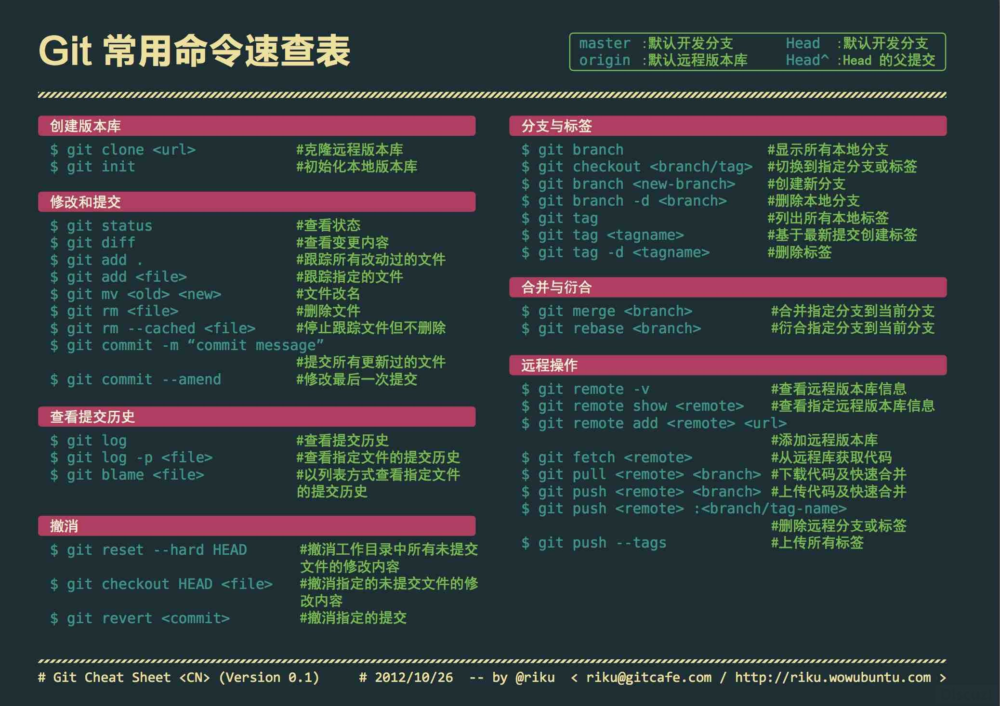
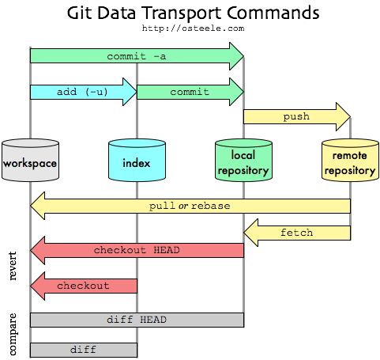

## Git使用手册

**创建仓库**
* 创建新文件夹并打开，然后执行 `git init` 以创建新的 git 仓库。  
* `git init`

**检出仓库**
* 创建一个本地仓库的克隆版本  
  `git clone /path_to_repo`  
* 创建一个远端仓库的本地克隆版本  
  `git clone username@host:/path_to_repo`

**工作流**  
你的本地仓库由 git 维护的三棵“树”组成。
* 第一个是你的 `工作目录`，它持有实际文件；
* 第二个是 `暂存区`（`Index`），它像个缓存区域，临时保存你的改动；
* 最后是 `HEAD`，它指向你最后一次提交的结果。

**添加和提交**  
* 将改动添加到暂存区  
  `git add <filename>git add *`  
* 将改动提交到本地仓库HEAD区  
  git commit -m "代码提交信息"   

现在，你的改动已经提交到了 HEAD，但是还没到你的远端仓库。

**推送改动**  
将本地仓库 HEAD 中内容提交到远端仓库
* 将改动提交到远端仓库。master为要推送的分支。  
  `git push origin master`  
* 将本地仓库连接到远端服务器  
	`git remote add origin <server>`

**分支**  
分支是用来将特性开发绝缘开来的。在你创建仓库的时候，`master` 是“默认的”分支。 在其他分支上进行开发，完成后再将它们合并到主分支上。
* 创建一个叫做“feature_x”的分支，并切换过去  
  `git checkout -b feature_x`  
* 切换回主分支  
  `git checkout master`  
* 再把新建的分支删掉  
  `git branch -d feature_x`  
* 除非你将分支推送到远端仓库，不然该分支就是不为他人所见的  
  `git push origin <branch>`   

**更新与合并**
要更新你的本地仓库至最新改动，执行：  
* 更新你的本地仓库至最新改动  
  `git pull`  
* 要合并其他分支到你的当前分支（例如 master）  
  `git merge`  
* 将文件标记为合并成功  
  `git add <filename>`
* 预览差异
  `git diff <source_branch> <target_branch>`

**创建标签**  
* 创建一个叫做 1.0.0 的标签,1b2e1d63ff 是你想要标记的提交ID的前10位字符。  
  `git tag 1.0.0 1b2e1d63ff`  
* 获取提交 ID, 可使用少一点的提交ID前几位，只要它的指向具有唯一性。  
  `git log`

**替换本地改动**
* 使用 HEAD中的最新内容替换掉工作目录中的文件,已添加到暂存区的改动以及新文件都不会受到影响  
  `git checkout -- <filename>`
* 如想丢弃在本地的所有改动与提交，可以到服务器上获取最新的版本历史，并将你本地主分支指向它：  
  `git fetch origin`  
  `git reset --hard origin/master`  
* 交互式添加文件到暂存区：  
  `git add -I`

**.gitignore**  
一般来说每个Git项目中都需要一个“.gitignore”文件，这个文件的作用就是告诉Git哪些文件不需要添加到版本管理中。

````
/mtk/               过滤整个文件夹
*.zip               过滤所有.zip文件
/mtk/do.c           过滤某个具体文件
!*.jar              指定要将哪些文件添加到版本管理中              
!/mtk/one.txt       指定要将哪些文件添加到版本管理中
````

如果你不慎在创建.gitignore文件之前就push了项目，那么即使你在.gitignore文件中写入新的过滤规则，这些规则也不会起作用，Git仍然会对所有文件进行版本管理。

**GitHub**
* `git clone git@github.com:wangwg2/vagrant.git`
* `git clone https://github.com/wangwg2/vagrant.git`

**git图解**

Git命令速查


Git Data Transport Commands

