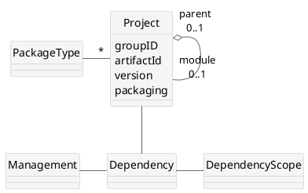
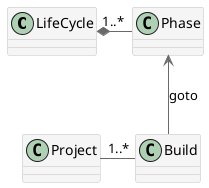
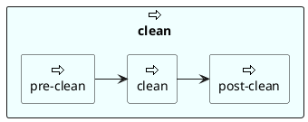
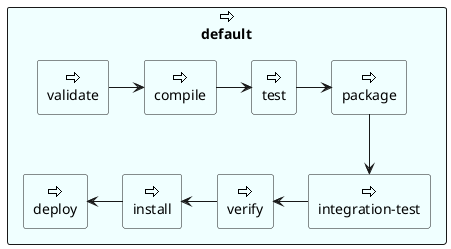
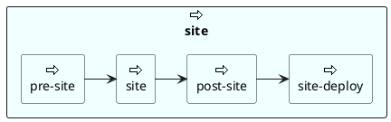
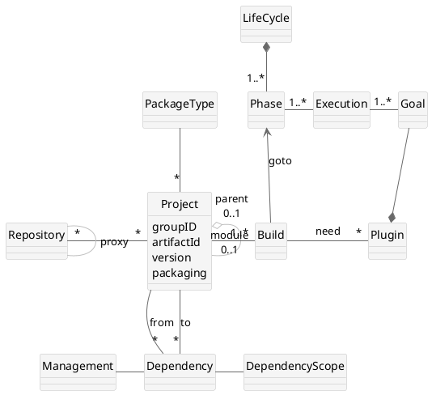

## Maven 核心概念

###### 概念说明

概念            | 说明
:-------------- | :-----------
LifeCycle       | 生命周期，maven内置default,sie,clean三个生命周期
Phase           | 阶段，每个生命周期有不同的阶段
Plugin          | 插件，实现实际的构建功能
Goal            | 一个插件可以实现多个goal，goal具备具体的功能
Execution       | 通过配置，决定在某个Phase执行哪些Goal
Project         | maven管理的目标：软件工程，小的工程可以聚合成大工程
PackageType     | 为了便于管理工程，按照构建目标区分成不同的工程类型，如jar，war，ear等
Dependency      | 依赖，project之间存在依赖关系
DependencyScope | maven对依赖定义了不同的作用范围
Management      | 可以配置一个工程如何管理依赖关系
Repository      | 仓库，存放包，分为本地库和远程库
Build           | 构建的动作。使用maven管理工程，主要是指定将project构建到某个phase

**项目对象模型（POM）**: POM是Maven中的里程碑式的模型。该模型的一部分已经构建到 Maven引擎（被亲切地称为反应堆 ）中，其余部分则通过一个名叫 pom.xml 的基于 XML 的元数据文件来声明。

**依赖项管理模型** : Maven 对如何管理项目的依赖项很在行. 依赖项管理是一片灰色地带, 典型的构建-管理工具和系统都未明确涉及. Maven 2 构建了 Maven 依赖项管理模型, 该模型能够适应大多数需求. 这个模型被证明是有效而高产的模型, 目前主要的开源项目都部署了该模型。

**构建生命周期和阶段**：和 POM 相关的概念是构建生命周期 和阶段。这是 Maven 2 的内嵌概念模型和现实物理世界之间的接口。使用 Maven 时，工作主要是通过插件来执行的。在构建周期中，Maven 2 通过遵循一系列定义好的阶段，将这些插件协调起来。

**坐标**： 对Maven坐标的使用贯穿于Maven配置文件和POM文件中。

#### pom.xml
```xml
<project xmlns="http://maven.apache.org/POM/4.0.0" xmlns:xsi="http://www.w3.org/2001/XMLSchema-instance"
  xsi:schemaLocation="http://maven.apache.org/POM/4.0.0 http://maven.apache.org/xsd/maven-4.0.0.xsd">
  <modelVersion>4.0.0</modelVersion>

  <groupId>com.dsl.maven</groupId>
  <artifactId>demo</artifactId>
  <version>1.0-SNAPSHOT</version>
  <packaging>jar</packaging>

  <name>Maven Demo Project</name>
  <url>http://maven.apache.org</url>

  <properties>
    <project.build.sourceEncoding>UTF-8</project.build.sourceEncoding>
  </properties>

  <dependencies>
    <dependency>
      <groupId>junit</groupId>
      <artifactId>junit</artifactId>
      <version>3.8.1</version>
      <scope>test</scope>
    </dependency>
  </dependencies>
</project>
```
**pom.xml说明**
* `project`：pom.xml文件中的顶层元素;
* `modelVersion`：指明POM使用的对象模型的版本。这个值很少改动。
* `groupId`：指明创建项目的组织或者小组的唯一标识。  
  GroupId是项目的关键标识，典型的，此标识以组织的完全限定名来定义。比如，`org.apache.maven.plugins`是所有Maven插件项目指定的`groupId`。 
* `artifactId`：指明此项目产生的主要产品的基本名称。  
  项目的主要产品通常为一个JAR文件。  
  第二，象源代码包通常使用`artifactId`作为最后名称的一部分。典型的产品名称使用这个格式：  
   `<artifactId>- <version>. <extension>`(比如：myapp-1.0.jar)。 
* `version`：项目产品的版本号。  
  Maven帮助你管理版本，可以经常看到SNAPSHOT这个版本，表明项目处于开发阶段。 
* `name`：项目的显示名称，通常用于maven产生的文档中。 
* `url`：指定项目站点，通常用于maven产生的文档中。 
* `description`：描述此项目，通常用于maven产生的文档中。


#### Maven 标准目录结构
````
project/              项目根
    pom.xml           Maven2的pom.xml文件
    src/
        main/         项目主体目录根
            java      源代码目录
            resources 所需资源目录
            filters   资源过滤文件目录
            assembly  Assembly descriptors
            config    配置文件目录根
            scripts   脚本库
            webapp    web应用的目录。WEB-INF、css、js等
        test/         项目测试目录根
            java      测试代码目录
            resources 所需资源目录
            filters   资源过滤文件目录
        site          与site相关的资源目录
    target/           输出目录根
        classes       项目主体输出目录
        test-classes  项目测试输出目录
````

#### 使用Archetype生成项目骨架
````
mvn archetype:generate
````

---
#### 工程（Project）
Maven管理的目标：工程（Project）



Maven是一个软件工程（Software Project）管理工具。 对于maven来说，一个软件工程的唯一标识是由开发者（groupId)、生成物（artifactId)、版本（version） 共同决定的。

每个工程都有一个打包类型，可以是jar, war, ear 或 pom。打包类型决定了工程最终产物的类型。 其中pom类型用于构件多模块工程。

工程之间有两种关系：依赖和聚合。

###### 工程依赖关系
依赖关系的管理是maven最为人称道的地方。一个工程可以依赖多个其他工程， 通过工程的唯一标识（`groupId`+`artifactId`+`version`)可以明确指明依赖的库及版本，而且能够处理 依赖关系的传递。 maven可以指定依赖的作用范围（scope），包括以下几种：
scope	   |编译期|测试期|运行期|	说明
:--------|:---:|:----:|:---:|------
compile  | V   |	V   |	V   |	默认scope
test	 	 |     |	V   |     | 只在测试期依赖，如junit包
provided | V   |	V	 	|     | 运行期由容器提供，如servlet-api包
runtime	 |     |  V   |	V	  | 编译期间不需要直接引用
system	 | V   |	V	 	|     | 编译和测试时由本机环境提供
由于依赖关系的传递性可能会导致依赖的版本、scope等发生冲突，maven提供了仲裁机制，同时也 允许自己通过配置进行依赖管理。

###### 工程聚合关系
前面提到pom类型用于于构件多模块工程，这体现了project之间的一种聚合关系： 将一系列小的模块聚合成整个产品。

通过聚合后的工程可以同时管理每个相关模块的构建、清理、文档等工作。 聚合关系通过在子工程中指定一个`pom`类型的`project`作为父`project`来定义。

---
#### Maven坐标
Maven坐标是一组可以唯一标识工件的三元组值(组ID，工件ID，版本)。  

Maven坐标为各种构件引入了秩序，任何一个构件都必须明确定义自己的坐标，而一组Maven坐标是通过一些元素定义的，它们是`groupId`、`artifactId`、`version`、`packaging`、`classifier`。
* `groupId`：定义当前Maven项目隶属的实际项目。
* `artifactId`：该元素定义实际项目中的一个Maven项目（模块），推荐的做法是使用实际项目名称作为artifactId的前缀。
* `version`：该元素定义Maven项目当前所处的版本。  
  Maven定义了一套完整的版本规范，以及快照（SNAPSHOT）的概念。
* `packaging`：该元素定义Maven项目的打包方式。
* `classifier`：该元素用来帮助定义构建输出的一些附属构件。  
  不能直接定义项目的`classifier`，因为附属构件不是项目直接默认生成的，而是由附加的插件帮助生成。

上述5个元素中，`groupId`、`artifactId`、`version`是必须定义的，`packaging`是可选的（默认为jar），而`classifier`是不能直接定义的。

###### 坐标样例
```xml
<groupId>com.mycompany.app</groupId>
<artifactId>myapp</artifactId>
<version>1.0-SNAPSHOT</version>
<packaging>jar</packaging>
```

###### 坐标规划的原则
* groupId ：坐标规划一个原则是基于项目域名衍生。项目就必须用groupId来定义。
* artifactId : artifactId来定义模块，而不是定义项目。在定义`artiafctId`时也加入项目的信息。
* version ： `<主版本>.<次版本>.<增量版本>-<限定符>`
  主版本主要表示大型架构变更，次版本主要表示特性的增加，增量版本主要服务于bug修复，而限定符如alpha、beta等等是用来表示里程碑。

---

#### 依赖
###### 依赖配置示例
```xml
<!--添加依赖配置-->
<dependencies>
  <!--项目要使用到junit的jar包，所以在这里添加junit的jar包的依赖-->
  <dependency>
    <groupId>junit</groupId>
    <artifactId>junit</artifactId>
    <version>4.9</version>
    <scope>test</scope>
  </dependency>
  <!--项目要使用到Hello的jar包，所以在这里添加Hello的jar包的依赖-->
  <dependency>
    <groupId>me.gacl.maven</groupId>
    <artifactId>Hello</artifactId>
    <version>0.0.1-SNAPSHOT</version>
    <scope>compile</scope>
  </dependency>    
</dependencies>
```

###### 依赖范围
依赖范围`scope`用来控制依赖和编译，测试，运行的`classpath`的关系. 主要的是三种依赖关系如下：
* `compile`： 默认编译依赖范围。对于编译，测试，运行三种`classpath`都有效
* `test`：测试依赖范围。只对于测试`classpath`有效
* `provided`：已提供依赖范围。对于编译，测试的`classpath`都有效，但对于运行无效。因为由容器已经提供，例如`servlet-api`
* `runtime`:运行时提供。例如:`jdbc`驱动


#### 存储库
Maven 存储库是普通的目录树。

Maven 维护了一个工件的 POM 文件，同时也为该工件和其存储库中的 POM 维护了检验和散列。当工件在存储库间转移时，这些文件帮助确保工件的完整性。该工件已由 Maven 的依赖项管理引擎从中央存储库下载并放置到本地存储库中。

仓库主要用于获取工程依赖的其他工程的生成物，也可用来部署（deploy）maven工程的生成物。 生成物包括各种打包的生成物以及pom文件。

如果有必要，一个工程可以部署到多个仓库。

仓库可以分为本地库（local）和远程库（remote）。本地库通常位于本机的`~/.m2/repository`文件夹， 远程库最常见的是maven中央库（），此外也会有一些私服库用于企业内部。


---
#### 生命周期
Maven的生命周期就是为了对所有的构建过程进行抽象和统一。这个生命周期包含了项目的清理、初始化、编译、测试、打包、集成测试、验证、部署和站点生成等几乎所有构建步骤。



Maven将工程（`Project`）的构建过程理解为不同的生命周期(`LifeCycle`)和阶段（`Phase`）。

在工程的构建过程中，存在着不同的生命周期，这些生命周期互相独立，之间也没有一定的顺序关系。

每个生命周期又划分为不同的阶段（`Phase`）。阶段之间有明确的顺序关系， 同一生命周期内的阶段必须按顺序依次执行。

生命周期抽象了构建的各个步骤，定义了它们的次序，但没有提供具体实现。
Maven设计了插件机制。每个构建步骤都可以绑定一个或者多个插件行为，而且Maven为大多数构建步骤编写并绑定了默认插件。

###### 三套生命周期
Maven拥有三套相互独立的生命周期，它们分别为clean、default和site。
* `clean` 生命周期的目的是清理项目
* `default` 生命周期的目的是构建项目
* `site` 生命周期的目的是建立项目站点。

再次强调一下它们是相互独立的，你可以仅仅调用`clean`来清理工作目录，仅仅调用`site`来生成站点。当然你也可以直接运行`mvn clean install site`运行所有这三套生命周期。

每套生命周期都由一组阶段(Phase)组成。如`clean`生命周期包括 `pre-clean`,`clean`,`post-clean` 三个阶段。我们平时在命令行输入的命令总会对应于一个特定的阶段。比如，运行`mvn clean`，这个的`clean`是Clean生命周期的一个阶段。

在一个生命周期中，运行某个阶段的时候，它之前的所有阶段都会被运行。也就是说，`mvn clean`等同于`mvn pre-clean clean`。如果我们运行`mvn post-clean`，那么`pre-clean`，`clean`都会被运行。这是Maven很重要的一个规则，可以大大简化命令行的输入。

###### clean生命周期
lean生命周期的目的是清理项目，它包含三个阶段：

* `pre-clean` 执行一些清理前需要完成的工作。
* `clean` 清理上一次构建生成的文件。
* `post-clean` 执行一些清理后需要完成的工作。

###### default生命周期
default生命周期定义了真正构建时所需要执行的所有步骤，它是所有生命周期中最核心的部分，其包含的阶段如下：代码生成器可以开始生成在以后阶段中处理或编译的源代码。


* `validate` 确保当前配置和 POM 的内容是有效的。这包含对 pom.xml 文件树的验证。
* `initialize` 在执行构建生命周期的主任务之前可以进行初始化。
* `generate-sources` 代码生成器可以开始生成在以后阶段中处理或编译的源代码。
* `process-sources` 处理项目主资源文件。一般来说，是对`src/main/resources`目录的内容进行变量替换等工作后，复制到项目输出的主`classpath`目录中。  
  提供解析、修改和转换源码。常规源码和生成的源码都可以在这里处理。
* `generate-resources` 可以生成非源码资源。通常包括元数据文件和配置文件。
* `process-resources` 处理非源码资源。修改、转换和重定位资源都能在这阶段发生。
* `compile` 编译项目的主源码。一般来说，是编译`src/main/java`目录下的Java文件至项目输出的主`classpath`目录中。  
  编译源码。编译过的类被放到目标目录树中。
* `process-classes` 处理类文件转换和增强步骤。字节码交织器和常用工具常在这一阶段操作。
* `generate-test-sources` mojo 可以生成要操作的单元测试代码。
* `process-test-sources` 处理项目测试资源文件。一般来说，是对`src/test/resources`目录的内容进行变量替换等工作后，复制到项目输出的测试`classpath`目录中。  
  在编译前对测试源码执行任何必要的处理。在这一阶段，可以修改、转换或复制源代码。  
* `generate-test-resources` 允许生成与测试相关的（非源码）资源。
* `process-test-resources` 可以处理、转换和重新定位与测试相关的资源。
* `test-compile` 编译项目的测试代码。一般来说，是编译`src/test/java`目录下的Java文件至项目输出的测试`classpath`目录中。
* `process-test-classes`
* `test` 使用单元测试框架运行测试，测试代码不会被打包或部署。  
  运行编译过的单元测试并累计结果。
* `prepare-package`
* `package` 接受编译好的代码，打包成可发布的格式，如JAR。
* `pre-integration-test` 准备集成测试。这种情况下的集成测试是指在一个受到一定控制的模拟的真实部署环境中测试代码。这一步能将归档文件部署到一个服务器上执行。
* `integration-test` 执行真正的集成测试。
* `post-integration-test` 解除集成测试准备。这一步涉及测试环境重置或重新初始化。
* `verify` 检验可部署归档的有效性和完整性。过了这个阶段，将安装该归档。
* `install` 将包安装到Maven本地仓库，供本地其他Maven项目使用。
* `deploy` 将最终的包复制到远程仓库，供其他开发人员和Maven项目使用。

若想了解进一步的这些阶段的详细信息，可以参阅[官方的解释](http://maven.apache.org/guides/introduc-tion/introduction-to-the-lifecycle.html)。

###### site生命周期
site生命周期的目的是建立和发布项目站点，Maven能够基于POM所包含的信息，自动生成一个友好的站点，方便团队交流和发布项目信息。该生命周期包含如下阶段：

* `pre-site` 执行一些在生成项目站点之前需要完成的工作。
* `site` 生成项目站点文档。
* `post-site` 执行一些在生成项目站点之后需要完成的工作。
* `site-deploy` 将生成的项目站点发布到服务器上。


---
###### Maven核心概念
